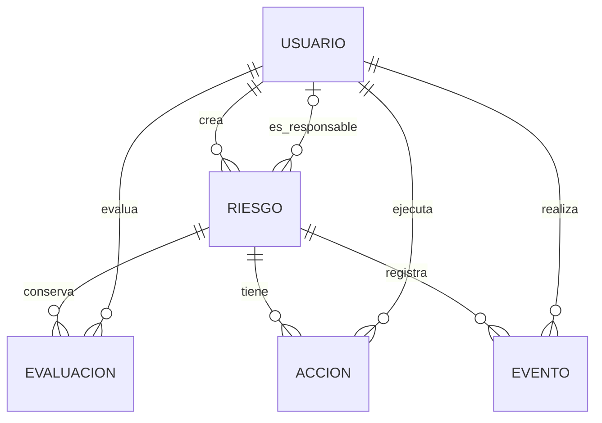

# 05. Modelo de datos

**Estado:** este documento presenta una propuesta de modelo conceptual para el MVP. Los modelos Django y las migraciones todavía no están implementados.

**Referencia obligatoria:** [guía del PFM](../INSTRUCCIONES-PFM.md), requisitos de modelos, persistencia, base de datos e integridad.

## Entidades propuestas

| Entidad | Propósito | Atributos principales |
| --- | --- | --- |
| Usuario | Identidad y acceso con autenticación Django. | Identificador, nombre, identificador de acceso, estado activo y grupo de rol. Contraseña gestionada mediante hashing Django. |
| Riesgo | Registro central de un riesgo de TI. | Identificador, título, descripción, estado, responsable opcional hasta asignación, creador, fechas de creación y actualización, fecha de última entrada en monitorización y fecha, motivo y evaluación de referencia del cierre cuando corresponda. |
| Evaluación | Valoración de un riesgo en un momento dado. | Identificador, riesgo, probabilidad, impacto, justificación, evaluador y fecha. Puntuación calculada como probabilidad × impacto. |
| Acción de tratamiento | Trabajo de mitigación vinculado al riesgo. | Identificador, riesgo, título, descripción, encargado, fecha objetivo, progreso, estado y fechas de creación y actualización. |
| Evento del riesgo | Registro de los cambios relevantes para seguimiento. | Identificador, riesgo, actor, tipo de evento, fecha y resumen del cambio autorizado. |

El MVP confirmado cubre una empresa. Este modelo no incluye una entidad de organización ni aislamiento entre múltiples empresas. Cualquier ampliación de ese alcance requerirá revisar el modelo y todos los permisos.

## Relaciones

Un riesgo recién identificado puede carecer de responsable y evaluaciones. Cada acción tendrá un encargado. Los eventos se registrarán para creación, cambios de título o descripción, evaluación, asignación, avance y cambios de estado; su detalle debe limitarse a lo necesario para explicar la evolución. El evento de cierre conservará también el actor y la referencia a la evaluación utilizada.

## Evaluación y prioridad

En este diseño, probabilidad e impacto serán enteros entre 1 y 5. Se propone calcular la puntuación en el backend y rechazar un valor independiente enviado por el cliente. El nivel se derivará de los [umbrales propuestos](02-requisitos.md).

Se propone conservar cada evaluación sin sobrescribirla, editarla ni eliminarla mediante operaciones de negocio. La fecha se asignará en el servidor. La evaluación vigente será la más reciente por fecha y, en caso de empate, identificador. La puntuación actual se derivará de esa evaluación para evitar copias contradictorias. Sin evaluación, el riesgo mostrará SIN EVALUAR. Los descriptores y el horizonte propuesto de doce meses se definen en [02-requisitos.md](02-requisitos.md).

La aptitud para cierre se comprobará frente a la última entrada en MONITORIZACIÓN y al último cambio de título, descripción o responsable. El modelo y los eventos deberán permitir determinar ese orden, incluidos los empates de fecha, sin basarse únicamente en la fecha general de actualización. El mecanismo técnico concreto sigue pendiente de implementación. El cierre conservará una referencia a la evaluación que lo justificó; deberá pertenecer al mismo riesgo y ser la vigente en ese momento.

En el diseño propuesto, completar acciones no modificará automáticamente la evaluación. La nueva puntuación requerirá una valoración explícita del gestor.

## Restricciones y consistencia

Para la implementación, se proponen las siguientes restricciones y mecanismos de consistencia:

- Exigir título y descripción del riesgo y justificación de la evaluación.
- Validar en el backend y mediante restricciones de base de datos los rangos de probabilidad, impacto y progreso.
- Validar coherencia entre progreso y estado de la acción: 0% PENDIENTE, 1–99% EN CURSO, 100% COMPLETADA.
- Validar asignaciones a usuarios activos y transiciones según [02-requisitos.md](02-requisitos.md).
- Crear acciones con progreso 0%; permitir preparar y asignar acciones en EVALUADO y EN TRATAMIENTO, pero actualizar progreso y notas de avance únicamente en EN TRATAMIENTO.
- Bloquear cambios de acciones en MONITORIZACIÓN y de datos, evaluaciones y acciones en CERRADO, conforme al MVP confirmado sin reapertura.
- Validar cierre únicamente desde MONITORIZACIÓN, con responsable activo, acciones completas, reevaluación apta de nivel BAJO o MEDIO y motivo.
- Guardar en una transacción la operación y su evento para evitar un cambio sin historial.
- Serializar las operaciones que compitan sobre un riesgo o acción para impedir que dos cambios concurrentes incumplan las condiciones de cierre; mecanismo concreto pendiente de implementación.
- Proteger referencias de historial frente a eliminaciones en cascada. Se propone desactivar usuarios y cerrar riesgos conservando los registros, sin ofrecer eliminación de negocio en el MVP.

## Persistencia, migraciones y datos de demostración

Se propone PostgreSQL para el entorno desplegado, con la justificación recogida en [06-arquitectura.md](06-arquitectura.md). La elección definitiva y sus dependencias siguen pendientes. Cuando existan migraciones Django, se conservarán en Git y se documentará su ejecución.

Se prepararán datos ficticios reproducibles con el ejemplo de MFA, riesgos sin evaluar y evaluaciones sucesivas. Las contraseñas, credenciales y datos personales reales permanecerán fuera del repositorio.

## Protección y recuperación

Los nombres y cuentas de los usuarios de la aplicación pueden ser datos personales. Se propone limitar el acceso según rol y asignación y aplicar el mismo alcance en los registros y resúmenes React. Antes de usar datos de una empresa real, será necesario definir su conservación y eliminación. Las copias y la restauración previstas se describen en [07-seguridad.md](07-seguridad.md).
