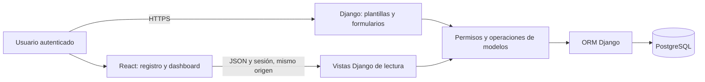

# 06. Arquitectura y tecnologías

**Estado:** base técnica adoptada para el MVP. La aplicación, las dependencias instaladas y el despliegue todavía están pendientes. Las decisiones no acreditan funcionamiento ni seguridad.

**Referencia obligatoria:** [guía del PFM](../INSTRUCCIONES-PFM.md), «3. Listado de tecnologías utilizadas» y «Requisitos técnicos mínimos». La adecuación al máster se basa en los conceptos recogidos en [AGENTS.md](../AGENTS.md): modelos, ORM, admin, usuarios y grupos, vistas, plantillas, formularios, ModelForms, decoradores, configuración y pruebas.

## Tecnologías elegidas y justificación

Django y la integración React cumplen los requisitos del PFM. Las versiones y herramientas complementarias son decisiones del proyecto, no exigencias académicas. Se adoptan estas series; al crear los archivos de dependencias se fijarán versiones exactas con sus actualizaciones de seguridad y se comprobará la instalación conjunta.

| Componente | Decisión | Justificación |
| --- | --- | --- |
| Backend | Python 3.12 y Django 5.2 LTS. | Mantener una versión de soporte prolongado y las herramientas estándar del temario. |
| Interfaz principal | Plantillas Django, HTML y CSS propio; formularios y ModelForms. | Resolver acceso, fichas y operaciones dentro de Django. |
| Frontend React | React 19 y React DOM 19, con JavaScript y JSX. | Implementar el registro y el dashboard con componentes, estado, efectos y `fetch`. |
| Compilación frontend | Node.js 24 LTS, npm y Vite 8 con su complemento React compatible. | Compilar las dos vistas e incorporarlas a los estáticos Django. Node se utiliza para desarrollo y compilación. |
| Base de datos | PostgreSQL 17 desde el primer arranque, con Psycopg 3. | Usar el mismo motor en desarrollo, pruebas y producción y comprobar los bloqueos necesarios para cierre y cuentas. |
| Autenticación | `User`, sesiones y tres grupos Django. | Reutilizar usuarios y contraseñas del framework y validar un rol por cuenta. |
| Gestión de cuentas | Admin Django adaptado a las [reglas de cuentas](03-usuarios.md). | Reutilizar formularios y registro administrativo con permisos limitados. |
| Interfaz de datos | Dos vistas Django con `JsonResponse`, de solo lectura. | Proporcionar los datos reales a React manteniendo permisos y cálculos en el backend. |
| Pruebas | Herramientas de Django: `TestCase`, cliente de pruebas y `TransactionTestCase` para concurrencia. | Comprobar flujos, permisos y persistencia con las herramientas del framework. |
| Dependencias y configuración | `venv`, `pip`, `requirements.txt`, `package.json`, `package-lock.json` y variables de entorno mediante `os.environ`. | Instalación reproducible y configuración fuera del código; ejemplos sin secretos. |
| Control de versiones | Git y GitHub. | Código completo y commits progresivos, como exige el PFM. |
| Despliegue | Servicio en nube o VPS con Python, PostgreSQL y HTTPS; proveedor pendiente. | Mantener una URL pública estable durante revisión y defensa. Docker queda fuera de la base elegida; es opcional en la guía. |

Django documenta la [compatibilidad de 5.2 LTS con Python 3.12](https://docs.djangoproject.com/en/5.2/releases/5.2/) y el [soporte de PostgreSQL y Psycopg](https://docs.djangoproject.com/en/5.2/ref/databases/#postgresql-notes). Las referencias frontend son las [versiones de React](https://react.dev/versions), el [ciclo de Node.js](https://nodejs.org/en/about/previous-releases) y los [requisitos de Vite 8](https://vite.dev/blog/announcing-vite8.html). Se comprobarán los parches vigentes al instalar; todavía no hay una combinación instalada ni probada en este repositorio.

Se sustituye la propuesta anterior de empezar con SQLite y cambiar después a PostgreSQL. PostgreSQL requiere una configuración local inicial, pero permite mantener un solo motor y probar las mismas reglas desde el comienzo. Esta decisión responde a la integridad del MVP; el PFM no exige un motor concreto.

## Componentes y recorrido de una petición

Django atenderá las páginas, los formularios y las dos peticiones JSON. Las reglas de negocio y la autorización residirán en el backend. PostgreSQL conservará riesgos, evaluaciones, acciones y eventos.

Django y React se servirán desde el mismo origen. Las dos páginas React se montarán en plantillas Django y usarán los archivos compilados por Vite. En el primer montaje se podrá recompilar con Vite en modo observación y servir el resultado mediante los estáticos de desarrollo de Django. Así se conserva la misma sesión sin configurar otro sistema de autenticación. La URL pública puede conducir a la pantalla de acceso; los datos requieren autenticación.

## Organización del código

Se creará un proyecto Django `config`, una aplicación `risks` para modelos y operaciones del dominio, y una aplicación `accounts` para adaptar el admin y los formularios de cuentas, reutilizando `User`. El código React se ubicará en `frontend/`. Las plantillas y estáticos seguirán la estructura habitual de Django.

Las vistas de negocio serán funciones y utilizarán decoradores de autenticación, comprobaciones de rol y consultas filtradas por alcance. El acceso y cierre de sesión reutilizarán las vistas de autenticación de Django. Los formularios validarán la entrada y los métodos de modelo aplicarán las reglas de evaluación, progreso y transiciones. Se evitará duplicar estas reglas en React.

El admin de riesgos, evaluaciones, acciones e historial será de consulta. La gestión de cuentas usará formularios adaptados y una función explícita para aplicar el cambio de rol o actividad con sus comprobaciones. Los tres grupos tendrán permisos predefinidos; el administrador de negocio no editará privilegios técnicos ni cuentas de superusuario.

Se utilizarán componentes funcionales React, `useState`, `useEffect` y `fetch`. Las rutas y la navegación seguirán en Django. Esta base no necesita una SPA completa, Django REST Framework, JWT, Redux, TypeScript, tareas en segundo plano ni una arquitectura por servicios. Las ampliaciones requerirán una necesidad concreta del alcance.

## Historial e integridad desde el primer flujo

El modelo Evento del riesgo se incorporará junto a Riesgo y Evaluación. La creación, edición, asignación y primera evaluación producirán eventos desde que cada operación exista. La primera evaluación conservará también el cambio de IDENTIFICADO a EVALUADO. La ficha permitirá consultar esos eventos desde el primer hito.

Cada operación y sus eventos se guardarán dentro de `transaction.atomic()`: se guardará todo o se deshará todo. Las mutaciones de un riesgo existente usarán `select_for_update()` sobre ese riesgo antes de leer y validar su estado. Las modificaciones de sus acciones seguirán el mismo criterio para impedir, por ejemplo, un cierre simultáneo a un cambio de progreso. Las operaciones se implementarán mediante llamadas explícitas, sin señales automáticas para generar el historial.

Los eventos de un mismo riesgo se ordenarán por su identificador incremental, asignado después de adquirir el bloqueo. Esto permitirá comparar evaluación, entrada en monitorización y cambios del riesgo aunque coincidan sus fechas. La evaluación vigente seguirá la regla de fecha e identificador definida en requisitos; su evento se usará para comprobar su orden frente a los demás cambios.

La gestión de cuentas y las asignaciones coordinarán también el bloqueo de los usuarios afectados, antes de bloquear riesgos, en un orden estable por identificador. Así una desactivación volverá a comprobar el trabajo pendiente mientras una asignación concurrente deberá volver a comprobar que la cuenta sigue activa. El control de al menos un Administrador activo se comprobará bajo bloqueo de las cuentas administrativas afectadas. Los detalles de estas funciones y sus pruebas se concretarán al implementarlas.

Las transacciones y los bloqueos son las ampliaciones necesarias al uso básico del ORM para cumplir las reglas de integridad ya confirmadas. Se explicarán con los ejemplos de cambio sin historial, cierre concurrente y desactivación con nueva asignación. No se considerarán verificados hasta ejecutar las pruebas en PostgreSQL.

## Contratos React–Django propuestos

| Vista | Petición de lectura propuesta | Respuesta y comportamiento |
| --- | --- | --- |
| Registro | GET /api/risks/ con filtros de estado, nivel y responsable. | Lista paginada con identificador, título, estado, responsable y última evaluación; SIN EVALUAR cuando corresponda. |
| Dashboard | GET /api/dashboard/. | Totales de riesgos abiertos por nivel y estado, más acciones pendientes y vencidas de riesgos abiertos. |

Los endpoints requerirán sesión y filtrarán los datos antes de calcular listas o agregados. El administrador y el gestor verán el registro de la empresa; el responsable solo su alcance. La exposición será una distribución de riesgos por nivel y estado, sin atribuir significado financiero a la suma de puntuaciones.

Antes de implementar estas vistas se concretarán parámetros, esquema JSON, ordenación, paginación, errores y el cómputo de acciones del dashboard del Responsable. React mostrará carga, ausencia de datos y errores; una sesión caducada conducirá a iniciar sesión mediante una respuesta que el cliente pueda reconocer, evitando interpretar HTML como JSON.

Las mutaciones del MVP se realizarán mediante formularios Django protegidos por CSRF. Esta decisión mantiene React dedicado a la consulta y conserva las operaciones en los formularios del temario.

## Despliegue y comprobación

Quedan pendientes el proveedor, el servidor de aplicación, la publicación de estáticos, HTTPS y los procedimientos de copia y restauración. La elección se realizará antes del despliegue. El README recogerá los comandos verificados de instalación, configuración, migración, compilación, pruebas y ejecución a medida que exista la aplicación.

La comprobación del primer hito cubrirá autenticación, roles, creación y evaluación de riesgos, persistencia, historial y rechazo de entradas y accesos inválidos. Después se verificarán acciones, cuentas, cierre y concurrencia; las dos vistas React deberán reflejar cambios persistidos y respetar los permisos.

La aplicación permanecerá accesible durante revisión y defensa. Se reproducirá el caso 4 × 5 = 20, el seguimiento de MFA, la reevaluación y el cierre en la URL pública. Capturas y diagramas de la implementación formarán parte de la memoria. Los secretos estarán fuera de Git y las medidas de producción se acreditarán mediante comprobaciones reales.
