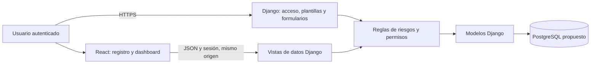

# 06. Arquitectura y tecnologías

**Estado:** Django y React son la base del diseño para cumplir el PFM; el resto de la arquitectura sigue siendo una propuesta. La aplicación y el despliegue todavía no están implementados.

**Referencia obligatoria:** [guía del PFM](../INSTRUCCIONES-PFM.md), «3. Listado de tecnologías utilizadas» y «Requisitos técnicos mínimos».

## Tecnologías previstas y justificación

Se distinguen las tecnologías exigidas por el PFM de las propuestas de diseño. Las versiones, dependencias y elecciones definitivas siguen pendientes.

| Componente | Tecnología | Justificación y estado |
| --- | --- | --- |
| Backend | Django, obligatorio. | Modelos, vistas, plantillas, autenticación y persistencia exigidos. Centraliza reglas y permisos del ciclo de riesgos. Versión pendiente. |
| Frontend | React, integración mínima obligatoria. | Se proponen dos vistas con datos reales: registro filtrable y dashboard de exposición. Versión pendiente. |
| Base de datos | PostgreSQL, propuesta. | Persistencia de datos relacionados, restricciones y transacciones para mantener la integridad del ciclo de riesgos. Versión y configuración pendientes. |
| Autenticación | Sesiones y grupos Django, propuesta. | Reutilizar autenticación y controles de acceso, con un rol de negocio por usuario. |
| Interfaz de datos | Vistas JSON Django, propuesta. | Contratos pequeños para las dos vistas React; las reglas se mantienen en el backend. |
| Herramientas frontend | Vite, propuesta. | Compilar los componentes React e integrarlos como archivos estáticos; versión y dependencias pendientes. |
| Control de versiones | Git y GitHub. | Exigidos para código completo, commits claros y repositorio de entrega. |
| Despliegue | VPS o nube, proveedor pendiente. | URL pública estable con HTTPS durante revisión y defensa. |
| Contenedores | Docker, opcional y no decidido. | Evaluar su utilidad al seleccionar el entorno; la guía no lo exige. |

## Componentes propuestos

Se propone una arquitectura Django con plantillas para acceso, fichas y formularios. Dos páginas incorporarán componentes React. Django atenderá las peticiones de datos y aplicará reglas de negocio, permisos e integridad; PostgreSQL conservará riesgos, evaluaciones, acciones y eventos.

Se propone servir Django y los recursos React desde el mismo origen para simplificar las sesiones y la integración. La URL pública puede conducir a la pantalla de acceso; los datos empresariales siguen sujetos a autenticación.

## Organización del código prevista

La organización propuesta contempla una aplicación Django para riesgos, evaluaciones, acciones y eventos; grupos Django para roles; plantillas para operaciones; componentes React para consulta; y reglas reutilizables que apliquen permisos y transiciones a cualquier entrada.

Las carpetas de implementación se añadirán cuando comience el desarrollo. La documentación existente sigue en `docs/`.

## Contratos React–Django propuestos

| Vista | Petición de lectura propuesta | Respuesta y comportamiento |
| --- | --- | --- |
| Registro | GET /api/risks/ con filtros de estado, nivel y responsable. | Lista paginada con identificador, título, estado, responsable y última evaluación; SIN EVALUAR cuando corresponda. |
| Dashboard | GET /api/dashboard/. | Totales de riesgos abiertos por nivel y estado, más acciones pendientes y vencidas de riesgos abiertos. |

En los contratos propuestos, los endpoints requerirán sesión y filtrarán los datos antes de calcular listas o agregados. El administrador y el gestor verán el registro de la empresa; el responsable solo su alcance. La exposición se presentará como una distribución de riesgos por nivel y estado, sin atribuir significado financiero a la suma de puntuaciones.

Antes de implementar estas vistas, será necesario concretar los parámetros, el esquema JSON, la paginación y las respuestas de error de los contratos. React mostrará carga, ausencia de datos y errores; una sesión caducada debe conducir a iniciar sesión, evitando recibir o interpretar HTML como JSON.

Se propone realizar las mutaciones del MVP mediante formularios Django protegidos por CSRF. Si se incorporan mutaciones desde React, deberán reutilizar las mismas reglas y enviar la protección CSRF correspondiente.

## Despliegue y configuración

Quedan pendientes la elección del proveedor y la definición del servidor de aplicación, el tratamiento de estáticos, la conexión PostgreSQL, las variables de entorno y HTTPS. Durante la implementación se elegirán las versiones y dependencias y se documentarán instalación, configuración, migraciones, ejecución y uso en el [README](../README.md).

La aplicación deberá permanecer accesible mediante una URL pública durante toda la revisión y defensa, como exige el PFM. La guía no exige dominio propio. La propuesta de despliegue incluye secretos fuera de Git y copias restaurables, pendientes de implementación y verificación.

## Decisiones y comprobación

La confirmación de cada propuesta quedará documentada junto con la necesidad, la decisión, la justificación y las consecuencias. La verificación deberá cubrir autenticación, plantillas, persistencia y el flujo principal; también deberá comprobar que las dos vistas React reflejen cambios persistidos y respeten los permisos.

Cuando haya código y despliegue, se reproducirán el caso 4 × 5 = 20, el seguimiento de MFA, la reevaluación y el cierre en la URL pública. Las capturas y los diagramas de la implementación formarán parte de la memoria; las decisiones deberán poder explicarse durante la defensa.
